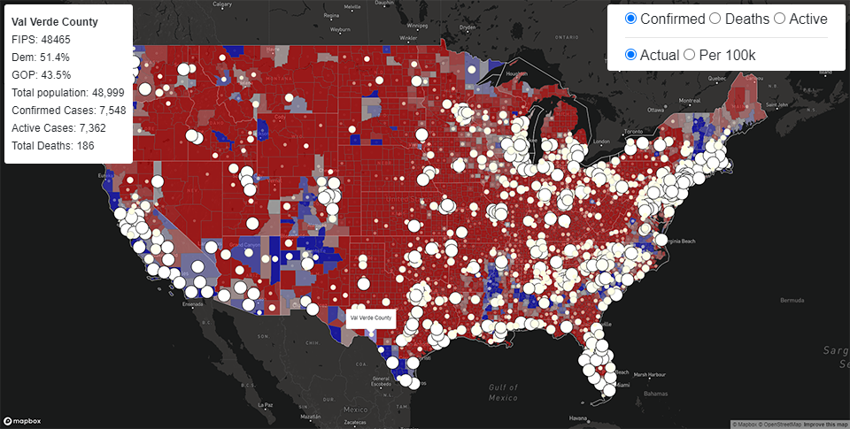

# USA Covid & Political Map 
Using Mapbox API to project the 2016 USA political information with an overlay of COVID-19 data to compare democrat vs republican rates of infection.

The COVID19 data is requested from the arcgis.com API.

# Technologies
- ASP.NET Core
- Razor with Javascript
- JWT Authentication
